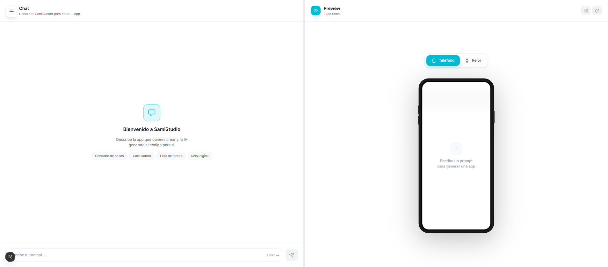

# AppStudio

AI app builder for Android and Wear OS. Describe an idea in Spanish, and AppStudio generates a React Native/Expo app, detects the right device target, and shows a direct interactive preview inside a phone or watch mockup.



## What It Does

AppStudio is a web-based app generator inspired by tools like Rork, Bloom, Lovable and Codex-style agent UX. It uses Ollama Cloud chat models to produce a single-file Expo app, then runs that app through Expo Snack's runtime without showing the Snack editor.

The interface is built around a chat and a live device preview. The AI can target a phone or a circular Wear OS watch, and the UI switches the mockup automatically.

## Features

- AI chat for generating React Native and Expo apps
- Automatic phone/watch target detection with AI-correctable metadata
- Direct interactive preview using `snack-sdk` and `webPreviewURL`
- Full-screen preview route that opens only the generated app
- Phone and Wear OS mockups with logical device viewports
- Circular Wear OS preview support
- Streaming Ollama responses with in-chat thinking animation
- Elapsed work time while the AI is generating, plus final "Trabajo durante X" status
- Response modes: fast, balanced, and reasoning-focused
- Markdown renderer with code blocks, lists, headings, links and inline code
- Local settings for Ollama API key and model selection
- Expo Go QR support for the generated Snack runtime
- Dark/light theme support

## Preview Model

AppStudio does not embed the full Snack editor. It creates or runs a Snack session and renders only the app runtime:

- Phone viewport: `390x834`
- Circular watch viewport: `220x220`
The mockup scales the logical viewport into the visible screen shape, so generated apps can be written against realistic dimensions while still fitting inside the visual device frame.

## AI Contract

When the user asks for an app, SamiBuilder returns:

~~~text
<!-- samistudio:target=phone|watch;shape=round;title=Short name -->

```jsx
// App.js
```
~~~

The metadata lets the UI choose the correct mockup. The prompt also tells the model to preserve behavior when adapting an app between phone and watch, for example keeping a timer as a countdown rather than changing it into a stopwatch.

## Tech Stack

- Next.js 16 App Router
- React 19
- TypeScript
- Tailwind CSS v4
- Framer Motion
- Lucide React
- react-resizable-panels
- Ollama Cloud API
- Expo Snack and `snack-sdk`
- qrcode.react

## Project Structure

```text
app/
  api/
    chat/route.ts       # Ollama Cloud proxy
    snack/route.ts      # Programmatic Snack creation
  components/
    chat/               # Chat UI, markdown, input and messages
    layout/             # App shell, sidebar, settings
    preview/            # Mockups, runtime preview, full-screen preview
  hooks/
    useChat.ts
    useOllamaStream.ts
    useSnack.ts
  providers/
  lib/
  types/
```

## Local Development

```bash
npm install
npm run dev
```

Open http://localhost:3000.

## Usage

1. Open Settings and add your Ollama Cloud API key.
2. Pick a model and response mode.
3. Ask for an app, for example:

```text
creame una app simple de calculadora para movil
```

```text
crea un timer circular para reloj Wear OS
```

4. AppStudio generates the app and loads the interactive preview automatically.

## Environment

No server environment variables are required. The Ollama API key is stored locally in the browser and sent to `/api/chat`.

## Deployment

Deploy on Vercel or any Next.js-compatible host:

```bash
npm run build
npm run start
```

## Topics

`nextjs` `react` `typescript` `tailwindcss` `ai-app-builder` `ollama` `expo` `react-native` `expo-snack` `wear-os` `android` `no-code` `low-code` `code-generation` `framer-motion`

## Author

- GitHub: [@samilososami](https://github.com/samilososami)

## License

MIT
